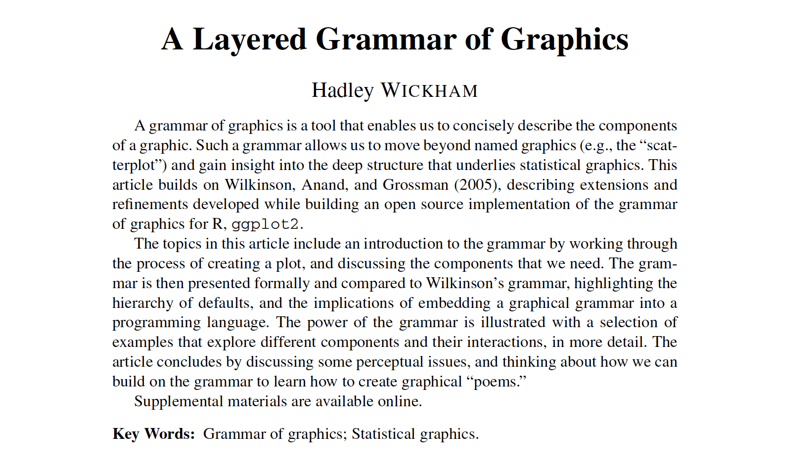
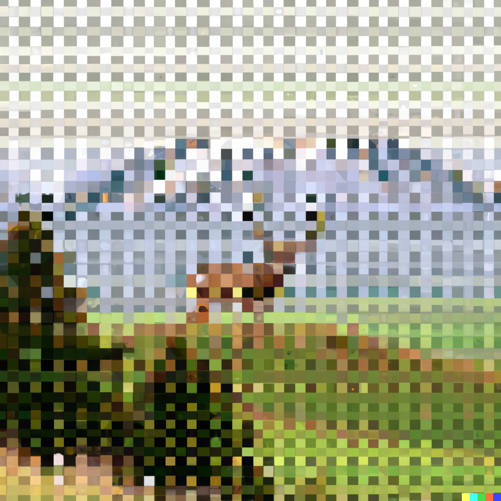
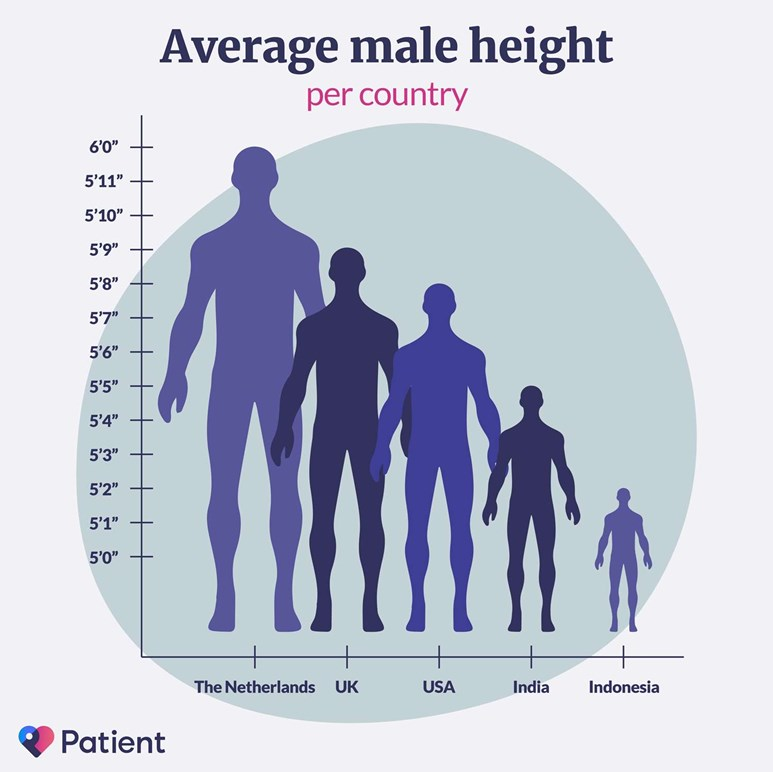
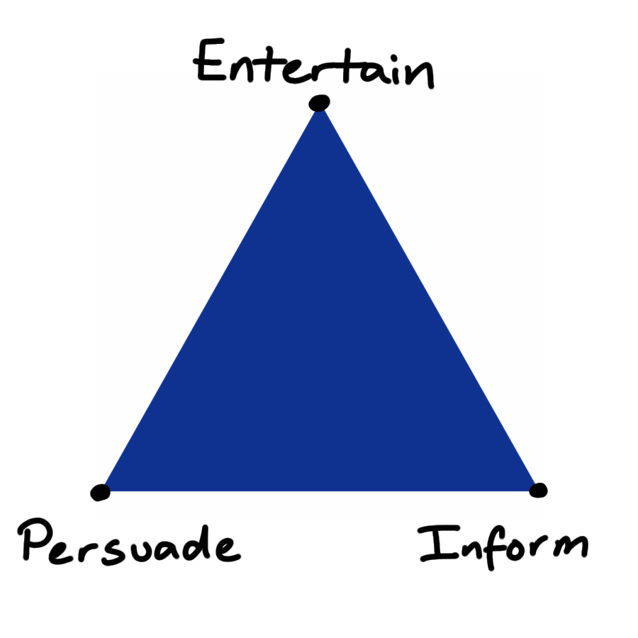

# Data Visualisation {#edav-visualisation}

::: {.rmdnote} 
Effective Data Science is still a work-in-progress. This chapter is largely complete and just needs final proof reading. 

If you would like to contribute to the development of EDS, you may do so at <https://github.com/zakvarty/data_science_notes>.
:::

## Introduction

### More than a pretty picture 

Data visualisation is an integral part of your work as a data scientist. 

::: medium_left
{alt="Book jacked showing the effect of global temperatures rising. A series of vertical stripes represent the annual global average temperature, progressing from blue on the left to red on the right."}
:::

You'll use visualisations to rapidly explore new data sets, to understand their structure and to establish which types of model might be suitable for the task at hand. Visualisation is also vital during model evaluation and when check the validity of the assumptions on which that model is based. These are relatively technical uses of visualisation, but graphics have a much broader role within your work of an effective data scientist. 

When well designed, plots, tables and animations can tell compelling stories that were once trapped within your data. They can also intuitively communicate the strength of evidence for your findings and draw attention to the most salient parts your argument.

Data visualisation is an amalgamation of science, statistics, graphic design and storytelling. It's multi-disciplinary nature means that we have to draw on all of our skills to ensure success. While there are certainly many ways to go wrong when visualising data, there are many more ways to get it right. 

This chapter won't be a a step-by-step tutorial of how to visualise any type of data. Nor will it be a line-up of visualisations gone wrong. Instead, I hope to pose some questions that'll get you thinking critically about exactly what you want from each graphic that you produce.

There are five things that you should think about when producing any sort of data visualisation. We will consider each of these in turn.

## Your Tools 🔨

### Picking the right tool for the job 

When you think of data visualisation, you might immediately think of impressive animations or complex, interactive dashboards that allow users to explore relationships within the data for themselves. 

Such tools are no doubt impressive but they are by no means necessary for an effective data visualisation. In many cases there is no technology is needed at all. The history of data visualisation vastly pre-dates that of computers and some of the most effective visualisations remain analogue creations. 

\begin{figure}
\includegraphics[width=1\linewidth]{images/303-data-visualisation/coffee-2} \caption{Coffee consumption, visualised. Jaime Serra Palou.}(\#fig:unnamed-chunk-2)
\end{figure}

This visualisation of a year's coffee consumption is an ideal example. Displaying the number of cups of coffee in a bar chart or line graph would have been a more accurate way to collect and display this data, but that wouldn't have the same resonance or impact and it certainly wouldn't have been as memorable. 

### Analogue or Digital 

#### Analogue Data Viz

Here we have another example of an analogue data visualisation that is created as part of data collection. Each member of the department is invited to place a Lego brick on a grid to indicate how much caffeine they have consumed and how much sleep they have had. The beauty of using Lego bricks here is that they are stackable and so create a bar plot over two dimensions. 

\begin{figure}
\includegraphics[width=1\linewidth]{images/303-data-visualisation/lego-coffee} \caption{Caffeination vs sleep, shown in lego. Elsie Lee-Robbins}(\#fig:unnamed-chunk-3)
\end{figure}

A third example can be found next to the tills in many supermarkets. Each customer is given a token as they pay for their goods. They can then drop this token into one of three large perspex containers as they leave the shop, each representing a different charity. At the end of the month £10,000 is split between the charities in proportion to the number of tokens. Because the containers are made from a transparent material you can see how the tokens are distributed, giving a visualisation of the level of support for each of the charities.

There are many other way of constructing a physical, analogue visualisation of your data and this doesn't need to be done as part of the data collection process. The simplest and perhaps most obvious most obvious is to create a plot of tabular data using a pen and paper. 

#### Digital Data Viz

When it comes to digital tools for data visualisation you have a plethora of options. The most similar to pen-and-paper plotting is to draw your visualisations using a Photoshop, or an open source equivalent like Inkscape. The benefit here is that if you misplace a line or dot you can correct this small error without having to start all over again. 

There are then more data-focused tools that have point-and-click interfaces. These are things like Excel's chart tools, or specialist visualisation software like Tableau. These are great because they scale with the quantity of data, so that you can plot larger amounts of raw data values that you wouldn't have the time or patience to do by hand - whether that's in an analogue or digital format. 

Analogue and point-and-click approaches to visualisation have the shared limitation of not being reproducible, at least not without extensive documentation explaining how the graphic was created. 

Using code to create your visualisations can resolve this reproducibility issue, and includes visualisation as a part of your larger, reproducible workflow for data science. Scripted visualisations also scale easily to large data sets and are easy to alter if any changes are required. The downside here is that there is a relatively steep learning curve to creating such visualisations, which is exactly what point-and-click methods are trying to avoid.

No matter how you produce your visualisations, the time cost of developing your skills in that medium is what buys you the ability to control and customise what you create. This upfront time investment will also often make you faster at producing future graphics in that medium.  

Whenever you approach a new visualisation problem, you should pick your tools and medium judiciously. You have to balance your immediate needs for speed, accuracy and reproducibility against your current skill level and improving those skills in the medium to long term. Unfortunately, the only way to make good visualisations is to make lots of bad ones and even more mediocre ones first.  

### ggplot2

If your aim is to produce a wide range of high quality data visualisation using R, then the `{ggplot2}` package is one of the most versatile and well documented tools available to you. 

The g's at the start of the package name stand for grammar of graphics. This is an opinionated, abstract approach to constructing data visualisations programmatically, by building them up slowly and adding additional plot elements one layer at a time. 

::: medium_right
{alt="Abstract of Grammar of Graphics paper by Hadley Wickham."}
:::

This idea of a  "grammar of Graphics" was originally introduced by Leland Wilkinson. The paper shown by Hadley Wickham, and the associated `{ggplot2}` package popularised this approach within the R community. Like many of the tidyverse collection of packages, `{ggplot2}` provides simple but specialised modular functions that can be composed to create complex visualisations.  

If you'd like to learn how to use `{ggplot2}`, I wouldn't recommend starting with the paper nor would I recommend trying to get started with the docs alone. Instead, I would suggest you work through an introductory tutorial, or one of the resources linked within the package documentation. Once you have a grasp of the basic principles the best way to improve is to try making your own plots, using reference texts and other people's work as a guide. A great source of inspiration here is the Tidy Tuesday data visualisation challenge. You can search for the challenge on Github to inspect both the plots made by other people and the code that was used to make them. 

__Learning `ggplot2`:__

- [Resources](https://ggplot2.tidyverse.org/#learning-ggplot2)
- [Tutorial](https://www.cedricscherer.com/2019/08/05/a-ggplot2-tutorial-for-beautiful-plotting-in-r/) 
- [Tidy Tuesday Github](https://github.com/search?p=1&q=tidy+tuesday&type=Repositories)

## Your Medium 📽 

### Where is your visualisation going? 

The second aspect that I recommend you think about before starting a data visualisation is where that graphic is going to be used. The intended location for your visualisation will influence both the composition of your graphic and also the amount of effort that you dedicate to it. 

::: medium_right
{alt="Hand drawn illustration showing different versions of the same graphic being used in an analysis, presentation, newspaper artilce and technical report."}
:::

For example, consider making an exploratory plot at the start of a project to improve your own understanding of the structure within your data. In this case you do not need to spend much time worrying about refining axis labels, colour schemes or which in file format to save your work.

When working on figure that will be included in a daily stand-up meeting with your team, then you should take a little more care to ensure that your work can be clearly understood by others, for example that the legend and axis labels are both large and sufficiently informative. 

Further refinement again will be required of this is for an external presentation. Is the message of the visualisation immediately clear? Will the graphic it still be clear when displayed in a boardroom or conference hall, or will it pixellate? Finally, how long will the audience have to interpret the visualisation while you are speaking? Even if slide decks are made available, very few audience members will actually refer to them before or after the presentation.

The opposing consideration has to be made when preparing a visualisation for a report or scientific paper. In this case plots and tables can be very small, particularly in two-column or grid layouts. You have to be wary about the legibility of your smallest text (think values on axes) and your visualisation can be clearly understood, whether the document is being read zoomed-in on a computer screen or printed out in black and white. 

### File Types 

::: medium_left
{alt="Exaggerated example of a pixellated image. Picture shows a stag standing in the countryside with a resolution of approximated 40 x 40 pixels."} 
:::

To ensure that your graphics are suitable for the intended medium it is helpful to know a little bit about image file types. 

There are two dominant types of image file: vector graphics and bitmap graphics. 

__Bitmap graphics__ store images as a grid of little squares and each of these pixels takes a single, solid colour. If you make a bitmap image large enough, either by zooming in or by using a really big screen, then these individual pixels become visible. Usually this isn't going to be your intention, so you need to ensure that the resolution of your graphic (its dimensions counted in pixels) is sufficiently large.  

__Vector graphics__ create images using continuous paths and then filling the areas that they enclose with flat colour. These vector images can be enlarged as much as you like without image quality becoming compromised. This is great for simple simple designs like logos, which have to be clear when used on both letterhead and billboards. 

However, these vector graphics are more memory intensive than bitmap images, particularly when there are many distinct colours or objects within the image. This can be a particular problem in data science, for example when creating a scatter plot with many thousands of data points.

It can often be useful to save both a bitmap and vector version of your graphics. This way you can use bitmap when you need small files that load quickly (like when loading a webpage) and vector graphics when you need your visualisation to stay sharp when enlarged (like when creating a poster or giving a presentation in an auditorium).

## Your Audience 👥

### Know Your Audience 

Data visualisations are a tool for communicating information. To make this communication as effective as possible, you have to target your delivery to the intended audience. 

- Who is the intended audience for your visualisation? 

- What knowledge do they bring with them? 

- What assumptions and biases do they hold?

Creating _personas_ for distinct user groups can be a helpful way to answer these questions, particularly when the user population are heterogeneous.

::: medium_right
{alt="Illustation of three different user groups, where each group wears a jumper with a different style of neckline."}
:::

To know _how_ to target your delivery to a particular audience, you fist have to identify exactly who that is. 

To make a compelling data visualisation you have to have some idea of the background knowledge that the viewer brings. Are they a specialist in statistics or data science, or does their expertise lie in area application? Are the findings that you're presenting going to come as a surprise to them, or act confirmation of their pre-existing body of knowledge. 

It's worth considering these prior beliefs and how strongly they are held when constructing your visualisation. Take the time to consider how this existing knowledge could alter or influence their interpretation of what you're showing to them. On the flip-side, you might be presenting information on a topic that the viewer is the best case ambivalent about or in the worst case is actively bored by. In that case, you can take special care to compose engaging visualisations to capture and hold the attention of the audience.

### Preattentive Attributes 

When crafting a visualisation we want to require as little work as possible from the viewer. 
To do this, we can use pre-attentive attributes, such as colour, shape size and position to encode our data values. 

\begin{figure}
\includegraphics[width=1\linewidth]{images/303-data-visualisation/preattentive-attributes} \caption{Examples of preattentive attributes}(\#fig:unnamed-chunk-4)
\end{figure}

These preattentive attributes are properties of lines and shapes that provide immediate visual contrast without requiring active thought from the viewer. As we will see, care needs to be taken here to ensure that we are don't mislead the viewer with how we use these attributes. 

### Example: First Impressions Count 

::: medium_left
{alt="A questionably designed barchart of average male heights in the Nederlands, United Kingdom, USA Inida and Indonesia."}
:::

This figure presents a bar chart of the mean height of males in several countries, but has swapped out the bars for human outlines. While the visualisation has an attractive, minimal design and a pleasant colour scheme, it doesn't do a good job of immediately conveying the relevant information to the viewer. 

The three main issues with this plot are all caused by swapping the bars of this plot for male silhouettes, and are linked to the difference in how lengths and areas are perceived by humans. Typically, we make immediate pre-attentive comparisons based on area but draw more accurate, considered comparisons when comparing lengths. 

By replacing bars with human outlines and not starting the height scale at zero, this plot breaks the proportionality of length and area that is inherent in a bar plot. This causes dissonance between immediate and considered interpretation of this plot. An additional issue is that the silhouettes overlap, creating a forced perspective that makes it seem like the outlines are also further back and therefore even larger if this perspective is taken into account. 

These three issues are important to consider when constructing your own visualisations. Are you showing all the values that the data could take, or focusing on a smaller interval to provide better contrast? If you are using the size of a circle to represent a value, are you changing the diameter or area in proportion to the data value? And finally, if you are making a plot that appears three-dimensional, have you done so on purpose and, if so, can one of those dimensions be better represented by an attribute that isn't position? 
 
### Visual Perception 

When reducing the dimensionality of your plot you may wish to represent a data value using colour rather than position. When deciding on how to use colour, you should keep your audience in mind.

Is your aim to two or more categories? In that case, you'll need to select your finite set of colours and ensure that these can be distinguished. 

Are you are representing a data value that is continuous or has an associated ordering? Then you will again have to select your palette to provide sufficient contrast to all viewers of your work. 

If you are representing a measurement that has a _reference value_ (for example 0 for temperature in centigrade) then a diverging colour palette can be used to represent data that are above or below this reference point. This requires some cultural understanding of how the colours will be interpreted, for example you are likely to cause confusion if you an encoding of red for cold and blue for hot. 

For colour scales without such a reference point then a gradient in a single colour is likely the best option. In either case, it is important to check that a unit change in data value represents a consistent change in colour across all values. This is not the case for the rainbow palette here (which is neither a single gradient or diverging). 

\begin{figure}
\includegraphics[width=1\linewidth]{images/303-data-visualisation/saturated-colour-scales} \caption{Some default colour scales in R}(\#fig:unnamed-chunk-5)
\end{figure}

To ensure accessibility of your designs, I would recommend one of the many on-line tools to simulate colour vision deficiency or using a pre-made palette where this has been considered for you. A good, low-tech rule of thumb is to design your visualisations so that they're still easily understood when printed in grey-scale. This can mean picking appropriate colours or additionally varying the point shape, line width or line types used. 

\begin{figure}
\includegraphics[width=1\linewidth]{images/303-data-visualisation/desaturated-colour-scales} \caption{Desatureated colour scales in R}(\#fig:unnamed-chunk-6)
\end{figure}

For a practical guide on setting colours see this [chapter](https://bookdown.org/rdpeng/exdata/plotting-and-color-in-r.html) of exploratory data analysis by Roger Peng.

### Alt-text, Titles and Captions 

> __Captions__ describe a figure or table so that it may be identified in a list of figures and (where appropriate).
>
> __Alternative text__ describes the content of an image for a person who cannot view it. ([Guide to writing alt-text](https://myaccessible.website/infographic/images/images-accessibility-alt-text ))
>
> __Titles__ give additional context or identify key findings. Active titles are preferable.
>

When visualisations are included in a report, article or website, they are often accompanied by three pieces of text. The title, the caption and the alt-text all help the audience to understand a visualisation but each serves a distinct purpose. 

#### Captions 
A caption is short description of a visualisation. Captions usually displayed directly above or below the figure or table that they describe. These captions serve two purposes: in a report, the caption can be used to look up the visualisation from a list of figures or tables. The second purpose of a caption is to add additional detail that you don't want to add to the plot directly. For example caption might be "Time series of GDP in the United States of America, 2017-2022. Lines show daily (solid), monthly (dashed) and five-year (dotted) mean values."

#### Alt-text 
Alt text or alternative text is used to describe the content of an image to a person who can't view it. This text is helpful for people with a visual impairment, particularly those who uses a screen reader. Screen reading software reads digital text out loud but can't interpret images. Such software replaces the image with the provided alternative text. Alt text is also valuable in cases when the image can't be found or loaded, for example because of an incorrect file path or a slow internet connection, because it'll be displayed in place of the image.

The purpose of alt-text is different from a caption. It's designed as a replacement for the image, not just a shorthand or to provide additional information. If there is an important trend or conclusion to be drawn from the visualisation (that is not already mentioned in the main text) this should be identified in the alt-text. This sort of interpretation is a key aspect of alt-text that shouldn't be included in a caption. 

#### Titles 
Titles give additional context that is not conveyed by the axis labels or chart annotations. Alternatively the title can be used like a newspaper headline to deliver the key findings of the visualisation. One example of this might be when looking at a visualisation that is composed of many smaller plots, each showing the GDP for a US state over the last five years. Title for each smaller plot would identify the state it is describing, while the overall title might be something like "All US states have increased GDP in the period 2017-2022".

If you are including this type of interpretive title, make sure that the same interpretation is clear in the alt-text. 

## Your Story 📖 

The fourth aspect of a successful data visualisation is that it must tell a story. This story doesn't need to be a multi-generational novel or even a captivating novella. If a picture speaks a thousand words, really what your aiming for is an engaging anecdote.  

Your visualisation should be something the grabs viewers attention and through its through its composition or content alters their knowledge or view of world in some way.

Telling effective stories requires planning. How you construct your narrative depends on what effect you want to have on your audience. I'd encourage you to think like a data journalist and go into your work with the intended effect clear in your mind. Is your purpose to inform them of a fact, to persuade them to use a different methodology or entertain them by presenting dull or commonplace data in a fresh and engaging way?

::: medium_right
{alt="Illustration of a blue triangle with the words entertain, persuade and inform written at each corner."}
:::

In reality your goal will be some mixture of these, at an interior point of this triangle. Clearly identifying this point will help you to present your visual story in a way that works towards your aims, rather than against them. 

On the point of presentation, it is important to realise that there is no neutral way to present information. In creating a visualisation you're choosing which aspects of the data to emphasise, what gets summarised and what is not presented at all. This is how you construct a plot that tells a clear and coherent story. However, there is more than one story that you could tell from a single dataset. 

As an example of this, let's consider a time-series showing the price of two stocks and in particular the choice of scale on the y-axis. Suppose the two stock have values fluctuating around \$100 per share. Choosing a scale that goes from \$90 to \$110 would emphasise the differences between the two stocks. Setting the lower limit to \$0 would instead emphasise that these variations are small relative to the overall value of the stocks. Both are valid approaches but tell different stories. Be clear and be open about which of these you are telling and why you have chosen that over the alternative. 

A final cross-over from data journalism is that your visualisations will be competing for your viewers attention. You have to compete against everything else that is going on in their lives.  Establish a clear "hook" within your visualisation to attract your viewer's attention and immediately deliver the core message. This might be done with a contrasting trend-line or an intriguing title. Lead their attention first to the key message and then the supporting evidence. 

## Your Guidelines 📝

### Standardise and Document 

The final consideration when creating visualisations is to reduce the number of considerations that you have to make in the future. This is done by thinking carefully about each of the decisions that you make and writing guidelines so that you make these choices consistently. 

The choices that go into making an effective data visualisation are important and deserve careful consideration. However, this consideration comes at a cost. To the employer this is the literal, financial cost of paying for your time. More broadly this is the opportunity cost of all the other things that you could have been doing instead. 

To be efficient in our visualisation design, we should extend our DRY coding principles the design processes. Make choices carefully and document your decisions to externalise the cognitive work required of you in the future. 

Many companies aware of these financial and opportunity costs and provide style guides for visualisations in a similar manner to a coding or writing style guide. This not only externalises and formalises many decisions, but it also leads to a more uniform style across visualisations and the data scientists producing them. This leads to a unified, house-style for graphic design and a visual brand that is easily identifiable. This is beneficial for large companies or personal projects alike. 

### Example Style Guides 

I'd highly recommend exploring some visualisation guides to get an idea of how these are constructed and how you might develop your own.  

Unsurprisingly some of the best guides come from media outlets and government agencies. These businesses are used to writing style guides for text to create and maintain a distinctive style across all of their writers. 

- BBC 
  - [Infographics Guidelines](https://www.bbc.co.uk/gel/features/how-to-design-infographics )
  - [R Cookbook](https://bbc.github.io/rcookbook/)
  - [`{bbplot}`](https://github.com/bbc/bbplot)
  
- [The Economist](https://design-system.economist.com/documents/CHARTstyleguide_20170505.pdf) 

- [The Office for National Statistics](https://style.ons.gov.uk/category/data-visualisation/)

- [Eurostat](https://ec.europa.eu/eurostat/web/products-eurostat-news/-/STYLE-GUIDE_2016)

- [Urban Institute](https://urbaninstitute.github.io/graphics-styleguide/)

- [The Pudding](https://pudding.cool/resources/) (learning resources)

The level of detail and technicality varies wildly between these examples. For instance, the BBC do not provide strong guidelines on the details of the final visualisation but do provide a lot of technical tools and advice on how to construct those in a consistent way across the corporation. They've even gone so far as to write their own theme for ggplot and to publish this as an R package!

## Wrapping Up 

🔨 Think about your _tools_.

📽 Think about your _medium_.

👥 Think about your _audience_.

📖 Think about your _story_.

📝 Think about your _guidelines_.

Data visualisation might seem like a soft skill in comparison to data acquisition, wrangling or modelling. However, it is often effective visualisations that have the greatest real world impact. 

It is regularly the highly effective figures within reports and presentations that determine which projects are funded or renewed.  Similarly, visualisations in press releases can determine whether the result of your study are trusted, correctly interpreted, and remembered by the wider public.

When constructing visualisations it is important to consider whether there are existing guidelines that provide helpful constraints to your work. From there, determine the story that you wish to tell and exactly who it is that your are telling that story to. Once this is decided you can select the medium and the tools that you use to craft your visualisation so that you have the greatest chance of achieving your intended effect. 
