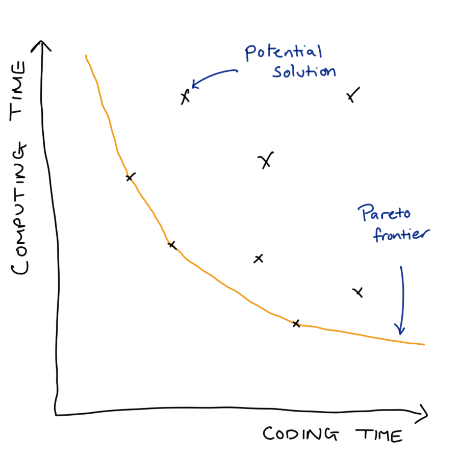

# Scalability {#production-scalability}


::: {.rmdimportant} 
Effective Data Science is still a work-in-progress. This chapter is currently a dumping ground for ideas, and we don't recommend reading it. 

If you would like to contribute to the development of EDS, you may do so at <https://github.com/zakvarty/data_science_notes>.
:::

<!-- 
Structure talk around Alex's parallelisation slides 

- Code profiling 
- vectorise 
- parallelise 
- Use a better language: C++, Python

* Documentation for 
- apply
- purr::map
- furr::pmap

* Advanced R (Second Edition) by Hadley Wickham. Chapters 23 and 24, measuring and improving performance 

*  Advanced R (Second Edition) by Hadley Wickham. Chapter 25, measuring and improving performance 

--> 

## Scalability and Production 

When put into production code gets used more and on more data. We will likely have to consider scalability of our methods in terms of

 - Computation time 
 
 - Memory requirements

When doing so we have to balance a trade-off between development costs and usage costs.

### Example: Bayesian Inference

- MCMC originally takes ~24 hours

- Identifying and amending bottlenecks in code reduced this to ~24 minutes. 

_Is this actually better?_ That will depend on a number of factors, including:


- human hours invested
- frequency of use
-  safe / stable / general / readable 
- trade for scalability


### Knowing when to worry 

Sub-optimal optimisation can be worse than doing nothing 

> ... programmers have spent far too much time worrying about efficiency in _the wrong places_ and at _the wrong times_; premature optimisation is the root of all evil (or at least most of it) in programming. - Donald Knuth




### Our Focus

Writing code that scales well in terms of computaiton time or memory used is a huge topic. In this section we restrict our aims to: 


- Basic profiling to find bottlenecks. 
- Strategies for writing scalable (R) code.
- Signpost advanced methods & further reading.


## Basics of Code Profiling

### R as a stopwatch

The simplest way to profile your code is to time how long it takes to run. There are three common ways to do this. 

Firstly, you could record the time before your code starts executing, the time it completes and look at the difference of those.


```r
t_start <- Sys.time()
Sys.sleep(0.5) # YOUR CODE
t_end <- Sys.time()

t_end - t_start
#> Time difference of 0.5086389 secs
```

The system.time function provides a shorthand for this if your code runs sequentially and extends the functionality to work for parallel code too.


```r
system.time(
  Sys.sleep(0.5)
)
#>    user  system elapsed 
#>   0.000   0.000   0.505
```


The `{tictoc}` package has similar features, but also allows you to add intermediate timers to more understand which parts of your code are taking the most time to run.


```r
library(tictoc)

tic() 
Sys.sleep(0.5) # YOUR CODE 
toc()
#> 0.505 sec elapsed
```


With `{tictoc}` we can get fancy 


```r
tic("total")
tic("first, easy part")
Sys.sleep(0.5)
toc(log = TRUE)
#> first, easy part: 0.508 sec elapsed
tic("second, hard part")
Sys.sleep(3)
toc(log = TRUE)
#> second, hard part: 3.009 sec elapsed
toc()
#> total: 3.524 sec elapsed
```


If your code is already very fast (but will be run _very_ many times, so further efficiency gains are required) then the methods may fail because they do not sample the state of the code at a high enough frequency. In those cases you might want to explore the `{mircobenchmark}` package.


## Profiling Your Code

To diagnose scaling issues you have to understand what your code is doing.

- Stop the code at time $\tau$ and examine the _call-stack_. 

  - The current function being evaluated, the function that called that, the function that called that, ..., top level function. 

- Do this a lot and you can measure (estimate) the proportion of working memory (RAM) uses over time and the time spent evaluating each function. 


```r
library(profvis)
library(bench)
```


### Profiling: Toy Example

Suppose we have the following code in a file called `prof-vis-example.R`. 


```r

h <- function() {
  profvis::pause(1)
}

g <- function() {
  profvis::pause(1)
  h()
}

f <- function() {
  profvis::pause(1)
  g()
  profvis::pause(1)
  h()
}
```

Then the call stack for `f()` would look something like this. 


We can examine the true call stack using the `profvis()` function from the `{profvis}` package. By saving the code in a separate file and sourcing it into our session, this function will also give us line-by-line information about the time and memory demands of our code.


```r
source("prof-vis-example.R")
profvis::profvis(f())
```


In both the upper histogram and the lower flame plot we can see that the majority of time is being spent in `pause()` and `h()`. What we have to be careful of here is that the upper plot shows the total amount of time in each function call, so `h()` appears to take longer than `g()`, but this is because it is called more often in the code snippet we are profiling.

## Notes on Time Profiling

We will get slightly different results each time you run the function 

  - Changes to internal state of computer
  - Usually not a big deal, mainly effects fastest parts of code
  - Be careful with stochastic simulations
  - Use `set.seed()` to make a fair comparison over many runs.

### Source code and compiled functions

If you write a function you can see the source of that function by calling it's name


```r
pad_with_NAs <- function(x, n_left, n_right){
  c(rep(NA, n_left), x, rep(NA, n_right))
}
```


```r
pad_with_NAs
#> function(x, n_left, n_right){
#>   c(rep(NA, n_left), x, rep(NA, n_right))
#> }
```

This is equally true for functions within packages. 


```r
eds::rnorm_rounded
#> function (n, mu = 0, sigma = 1, digits = 0) 
#> {
#>     raw_values <- stats::rnorm(n, mean = mu, sd = sigma)
#>     rounded_values <- base::round(raw_values, digits)
#>     return(rounded_values)
#> }
#> <bytecode: 0x7ff2bec01ca0>
#> <environment: namespace:eds>
```

Some functions use _compiled code_ that is written in another language. This is the case for dplyr's between function, which calls some compiled C++ code in the final line. 


```r
dplyr::between
#> function (x, left, right) 
#> {
#>     if (!is.null(attr(x, "class")) && !inherits(x, c("Date", 
#>         "POSIXct"))) {
#>         warn("between() called on numeric vector with S3 class")
#>     }
#>     if (length(left) != 1) {
#>         abort("`left` must be length 1")
#>     }
#>     if (length(right) != 1) {
#>         abort("`right` must be length 1")
#>     }
#>     if (!is.double(x)) {
#>         x <- as.numeric(x)
#>     }
#>     .Call(dplyr_between, x, as.numeric(left), as.numeric(right))
#> }
#> <bytecode: 0x7ff2c591d560>
#> <environment: namespace:dplyr>
```

It is also true for many functions from base R, for which there is (for obvious reason) no R source code.


```r
mean
#> function (x, ...) 
#> UseMethod("mean")
#> <bytecode: 0x7ff2c001b778>
#> <environment: namespace:base>
```

<br>

These compiled functions have no R source code, and the profiling methods we have used here don't extend into compiled code. See [{jointprof}]( https://github.com/r-prof/jointprof) if you really need this profiling functionality.   


## Memory Profiling 

`profvis()` can similarly measure the memory usage of your code. 


```r
x <- integer()
for (i in 1:1e4) {
  x <- c(x, i)
}
```


- Copy-on-modify behaviour makes growing objects slow.  
- Pre-allocate storage where possible. 
- Strategies and structures, see [R inferno](https://www.burns-stat.com/pages/Tutor/R_inferno.pdf) and [Effecient R](https://csgillespie.github.io/efficientR/performance.html). 


## Tips to work at scale 

__TL;DR:__ pick your object types carefully, vectorise your code and as a last resort implement your code in a faster language.


### Vectorise 

Two bits of code do the same task, but the second is much faster, because it involves fewer function calls. 


```r
x <- 1:10
y <- 11:20 
z <- rep(NA, length(x))

for (i in seq_along(x)) {
  z[i] <- x[i] * y[i]
}
```


```r
x <- 1:10
y <- 11:20 
z <- x * y
```


Where possible write and use functions to take advantage of vectorised inputs. E.g.


```r
rnorm(n = 100, mean = 1:10, sd = rep(1, 10))
```

Be careful of recycling! 


### Linear Algebra


```r
X <- diag(x = c(2, 0.5))
y <- matrix(data = c(1, 1), ncol = 1)

X %*% y
#>      [,1]
#> [1,]  2.0
#> [2,]  0.5
```


More on vectorising: [Noam Ross Blog Post](http://www.noamross.net/archives/2014-04-16-vectorization-in-r-why/)


## For loops in disguise 

### The apply family 

Functional programming equivalent of a for loop. [`apply()`, `mapply()`, `lapply()`, ...]

Apply a function to each element of a list-like object. 


```r
A <- matrix(data = 1:12, nrow = 3, ncol = 4)
A
#>      [,1] [,2] [,3] [,4]
#> [1,]    1    4    7   10
#> [2,]    2    5    8   11
#> [3,]    3    6    9   12
```


```r
# MARGIN = 1 => rows,  MARGIN = 2 => columns
apply(X = A, MARGIN = 1, FUN = sum)
#> [1] 22 26 30
```

This generalises functions from `{matrixStats}`


```r
rowSums(A)
#> [1] 22 26 30
```

### `{purrr}` 

Iterate over a single object with `map()`. 


```r
mu <- c(-10, 0, 10)
purrr::map(.x = mu, .f = rnorm, n = 5)
#> [[1]]
#> [1]  -8.195087  -8.989368 -10.088199  -9.163319  -8.464575
#> 
#> [[2]]
#> [1] -1.654084 -1.038659  1.139102 -1.252187  0.481957
#> 
#> [[3]]
#> [1]  9.597727 10.527231  9.612874  9.696898  9.875628
```

Iterate over multiple objects `map2()` and `pmap()`.


```r
mu <- c(-10, 0, 10)
sigma <- c(0, 0.1, 0)
purrr::map2(.x = mu, .y = sigma, .f = rnorm, n = 5)
#> [[1]]
#> [1] -10 -10 -10 -10 -10
#> 
#> [[2]]
#> [1] -0.03801368 -0.04968966  0.02012459  0.02915498 -0.06340106
#> 
#> [[3]]
#> [1] 10 10 10 10 10
```


```r
mu <- c(-10, 0, 10)
sigma <- c(0, 0.1, 0)

purrr::pmap(
  .f = rnorm, 
  n = 5,
  .l = list(
    mean = mu, 
    sd = sigma))
#> [[1]]
#> [1] -10 -10 -10 -10 -10
#> 
#> [[2]]
#> [1]  0.02739999 -0.06905531 -0.08768763  0.25609801 -0.15034565
#> 
#> [[3]]
#> [1] 10 10 10 10 10
```

For more details and variants see Advanced R [chapters 9-11](https://adv-r.hadley.nz/functionals.html) on functional programming. 

## Easy parallelisation with furrr 


- `{parallel}` and `{futures}` allow parallel coding over multiple cores. 

- Powerful, but steep learning curve.

- `{furrr}` makes this very easy, just add `future_` to purrr verbs. 


```r
mu <- c(-10, 0, 10)
furrr::future_map(
  .x = mu, 
  .f = rnorm,
  .options = furrr::furrr_options(seed = TRUE),
  n = 5) 
#> [[1]]
#> [1]  -9.444776 -11.577150 -10.534959  -9.629299  -9.998628
#> 
#> [[2]]
#> [1] -1.61985299 -0.04103247 -0.10977868  0.12614107  0.48226926
#> 
#> [[3]]
#> [1] 9.656295 8.772487 9.237617 9.776204 9.996922
```


This is, of course excessive for this small example!

One thing to be aware of is that we need to be very careful handling random number generation in relation to parallelisation. There are many options for how you might want to set this up, see [R-bloggers](https://www.r-bloggers.com/2020/09/future-1-19-1-making-sure-proper-random-numbers-are-produced-in-parallel-processing/) for more details. 

## Sometimes R doesn't cut it 

::: .medium_right
{alt="Logo of the Rcpp package. A speed dial turned up to 11 out of 10 in a blue hexagon."}
:::

RCPP: An API for running C++ code in R. Useful when you need: 

  - loops to be run in order 
  - lots of function calls (e.g. deep recursion)
  - optimised data structures 
  
Rewriting R code in C++ and other low-level programming languages is beyond our scope, but good to know exists. Starting point: Advanced R [Chapter 25](https://adv-r.hadley.nz/rcpp.html).


## Wrapping up 

### Summary {.unnumbered}

1. Pick you battles wisely
2. Target your energy with profiling
3. Scale loops with vectors
4. Scale loops in parallel processing
5. Scale in another language

### Help! {.unnumbered}
- Articles and blog links
- The R inferno [(Circles 2-4)](https://www.burns-stat.com/pages/Tutor/R_inferno.pdf) 
- Advanced R [(Chapters 23-25)](https://adv-r.hadley.nz/techniques.html), 
- Efficient R [(Chapter 7)](https://csgillespie.github.io/efficientR/performance.html#prerequisites-6). 

