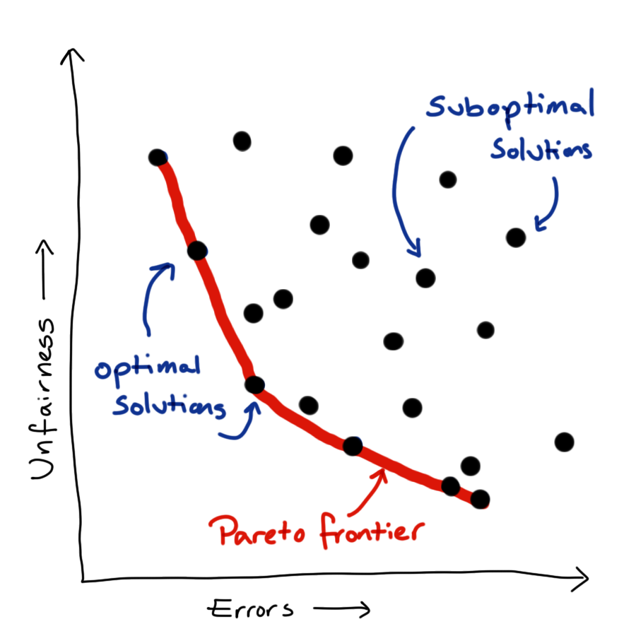

# Fairness {#ethics-fairness}

::: {.rmdnote} 
Effective Data Science is still a work-in-progress. This chapter is largely complete and just needs final proof reading. 

If you would like to contribute to the development of EDS, you may do so at <https://github.com/zakvarty/data_science_notes>.
:::

## Fairness and the Data Revolution 

\begin{center}\includegraphics[width=1\linewidth]{images/502-ethics-fairness/90s-windows-wallpaper} \end{center}

Before the 1990s, large datasets were typically only collected to understand huge, complex systems such as:

- the weather
- infrastructure
  - hospitals 
  - roads
  - train networks 
- stock markets 
- populations. 

Collecting high quality data on these systems was immensely expensive but paid dividends by allowing us to describe the expected behaviour of these systems at an aggregate level. Using this sort of information, we can’t make journeys or healthcare better at an individual level but we _can_ make changes to try and make these experiences better on average. 

Things changed with the widespread adoption of the internet in the mid-1990s and the subsequent surge in data collection, sharing and processing. Suddenly, we as individuals shifted from being just one part of these huge processes to being a complex process worth of modelling all on our own. 

\begin{center}\includegraphics{502-ethics-fairness_files/figure-latex/unnamed-chunk-3-1} \end{center}

It was at this point that focus shifted toward making individual, personalised predictions for specific people, based on the vast amounts of data that we generate as we go about our daily lives. 

This shift from aggregate to individual behaviour creates the opportunity not only for these predictions to systematically harm groups of people, as they always could, but also to acutely harm individuals.

## You are Your Data 

The blunt truth is that, as far as a data science model is concerned, you are nothing more than a point in a high-dimensional predictor space. 

\begin{center}\includegraphics[width=1\linewidth]{502-ethics-fairness_files/figure-latex/you-are-just-a-point-plot-1} \end{center}

The model might use your location in that space to group you with other points that are in some sense “nearby”. Alternatively, the model might estimate some information about you that it currently doesn’t have, based on what it knows about those surrounding points. These other points also represent unique humans with rich and fascinating lives - but the model doesn’t care about that, it is just there to group some points or predict some values.  

\begin{center}\includegraphics[width=1\linewidth]{502-ethics-fairness_files/figure-latex/classification-plot-1} \end{center}

The idea of fairness comes into data science when we begin to ask ourselves which predictors we should provide the model with when carrying out these tasks. We aren’t asking this from a model selection stand-point. We are asking what are morally permissible predictors, not what leads to a significant improvement in model fit. 

## Forbidden Predictors 

The argument about what features of a human being can be used to make decisions about them started well before the 1990s. The most contentious of these arguments centre around the inclusion of characteristics that are either immutable or not easily changed. Some of these characteristics including race, gender, age or religion receive legal protections.  These protected attributes are often forbidden to be used in important decisions, such as whether a bank loan is accepted. 
 
This natural lead us to ask what classifies as an important decision?  

-----

[Protected Characteristics](https://www.gov.uk/discrimination-your-rights) under the [Equality Act (2010)](https://www.legislation.gov.uk/ukpga/2010/15/contents) 

<!-- 
TODO: Format as two columns. Would be prettier but needs separate latex / html implementation
--> 

- age
- gender reassignment
- marriage / civil partnership
- pregnancy / parental leave
- disability

- race including colour, nationality, ethnic or national origin
- religion or belief
- sex
- sexual orientation

-----

We also need to be careful if these protected attributes actually have strong predictive power and would improve our predictions (potentially to the benefit of the groups that are being protected by these regulations). Just because a protected attribute isn’t used directly within a model that doesn’t mean the model will not discriminate according to that attribute.

If we have multiple predictors within a model, then withholding a protected attribute does not make the model ignorant of that attribute. If you have access to someone’s browsing history, where they live and some of their recent purchases you can probably make a fairly accurate profile of that person, including many of these supposedly protected attributes. In the same way, a model can use or combine attributes that are not legally protected to create a new variable that acts as an accurate proxy for the protected characteristic.  

And why wouldn’t our model do this? When using a standard loss function we have literally asked it to get the best possible predictive performance. If a protected attribute has predictive power then the model is likely to approximate it using the predictors that are available to it.

Before we see how to handle this concern, let's step back and consider how we can quantify and measure fairness in a model.

## Measuring Fairness 

Converting the concept of fairness into a mathematical statement is a very difficult task. This is partly because moving from natural language to precise formalism is hard, but it's also because the term fairness means different things to different people in different contexts. Because of this, there are many complementary definitions of fairness that all try to capture some intuitive notion of a fair model. However, these measures all capture different facets of this complicated concept. Despite this, these measures vary to such an extent they can't all be satisfied simultaneously.

I'll introduce four such measures shortly, focusing in on the case of binary outcomes where a "positive" response of 1 corresponds to an event that would be considered favourably when taken in context. For example this might be a loan that will be successfully repaid or that a person released on bail will not re-offend. 

- Binary outcome $Y \in \{0,1\}$.

We'll consider the simple case where a binary prediction is made in each instance, and where we want our predictions to be fair across the $k$ distinct levels of some protected attribute $A$. 

- Binary Prediction $\hat Y \in \{0,1\}$.
- Protected attribute $A$ takes values in $\mathcal{A} = \{a_1, \ldots, a_k\}$. 

### Demographic Parity 

The first, and potentially most obvious fairness definition is that of demographic parity. Here a model is deemed fair if, across all subgroups of the protected attribute, the probability of predicting a successful outcome is equal. 

 

> The probability of predicting a ‘positive’ outcome is the same for all groups.

 

$$\mathbb{P}(\hat Y = 1 | A = a_i) = \mathbb{P}( \hat Y = 1 | A = a_j), \  \text{ for all }\  i,j \in \mathcal{A}.$$

An obvious shortcoming demographic parity is that it does not allow us to account for the fact that a positive outcome might not be equally likely in each of these subgroups. In this way demographic parity is analogous to treating people equally, rather than equitably. 

### Equal Opportunity 

Equality of opportunity addresses this shortcoming by conditioning on a truly positive outcome. Equality of opportunity states that of those who are “worthy” of a loan (in some sense), all subgroups of the protected characteristic should be treated equally. 

 

> Among those who have a true 'positive' outcome, the probability of predicting a ‘positive’ outcome is the same for all groups.

 

$$\mathbb{P}(\hat Y = 1 | A = a_i, Y =1) = \mathbb{P}( \hat Y = 1 | A = a_j, Y=1), \  \text{ for all }\  i,j \in \mathcal{A}.$$

### Equal Odds

Of course, you have encountered two-way tables, type-I and type-II errors. Equally important as granting loans to people who will repay them is to deny loans to those who cannot afford them. 

A model satisfying the equal odds condition can identify true positives and false negatives equally well across all sub-groups of the protected characteristic. 

> Among those who have a true 'positive' outcome, the probability of predicting a ‘positive’ outcome is the same for all groups. 
>
> _AND_
>
> Among those who have a true 'negative' outcome, the probability of predicting a ‘negative’ outcome is the same for all groups.

 

$$\mathbb{P}(\hat Y = y | A = a_i, Y =y) = \mathbb{P}( \hat Y = y | A = a_j, Y=y), \ \text{ for all } \ y \in \{0,1\} \ \text{ and } \  i,j \in \mathcal{A}.$$

### Predictive Parity 

All of the measures we have considered so far consider the probability of a prediction given the true credit-worthiness of an applicant. Predictive Parity reverses the order of conditioning (as compared to equal opportunity).

It ensures that among those predicted to have a successful outcome, the probability of a truly successful outcome should be the same for all subgroups of the protected characteristic. This ensures that, in our financial example, the bank is spreading its risk exposure equally across all subgroups; each subgroup should have an approximately equal proportion of approved loans being successfully repaid. 

> The probability of a true 'positive' outcome for people who were predicted a 'positive' outcome is equal across groups. 

 

$$\mathbb{P}(Y = 1 | \hat Y = 1, A = a_i) = \mathbb{P}(Y_1 = 1 | \hat Y = 1, A = a_j) \ \text{ for all } \  i,j \in \mathcal{A}.$$

We can play devil's advocate here and say that this might not be appropriate if there is a genuine difference in the probability of successful repayment between groups.

## Metric Madness 

Even with this very simple binary classification problem that there are many ways we can interpret the term fairness. Which, if any, of these will be appropriate is going to be highly context dependent. 

An issue with many of these metrics, including some of those introduced, is that they require knowledge of the true outcome. This means that these metrics can only be evaluated retrospectively: if we knew this information to begin with then we wouldn't need a model to decide who get a loan. On top of this, it means that we only ever get information about the loans that are granted - we don't have access to the counter factual outcome of whether a loan that was not granted would have been repaid.

An additional problem is that evaluating these fairness metrics requires us to know which protected sub-group each individual belongs to. This is clearly a problem: to evaluate the fairness of our loan applications we need to know sensitive information about the applicants, who would - very reasonably - be unwilling to provide that information because it legally cannot be used to inform the decision making process. For this reason, an independent third-party is often required to assess fairness by collating data from the applicants and the bank. 

A third complication here is that these definitions deal in strict equalities. In any given sample, these are almost surely not going to be satisfied even if the metric is truly satisfied. A formal statistical test should be used to assess whether these differences are consistent with a truly fair model, however the more common approach is for regulators to set some acceptable tolerance on the discrepancy in metric values between sub-groups.

Finally, it is worth noting that all of these problems arise for a simple binary classifier but most models are far more complicated than this. Even working with these conditional probability statements requires careful attention, but things get much trickier when the response or sensitive attribute are continuous valued or when other, non-sensitive predictors are also included in the model.

## Modelling Fairly 

### Fairness Aware Loss Functions
Now we have some methods to detect and quantify the fairness of our models, how do we incorporate that into the model fitting process? 

::: medium_right
{alt="Plot of unfairness against error for many potential models. The Pareto frontier is shown by the portion of the convex hull of the points that is closest to the origin."}
:::

We now have multiple objectives: to predict our outcome as accurately as possible while also treating people as fairly as possible (by which ever fairness metric or combination of metrics we care to consider). Unfortunately, these things are generally in competition with each other. There is no one best model but rather a family of best models, from which we have to pick a single model to implement.

Can resolve this issue by linearisation, create our loss function as a linear weighted sum of the two component objectives. This simplifies the problem mathematically, but actually just shift the problem rather than resolving it. Up to scaling constant, each combination of weights corresponds to a unique point on the Pareto frontier, so we have just translated our problem from picking a point on the frontier to picking a pair of weights.  

To do actually resolve this issue we need to define our relative preference between fairness and predictive power. When I say "our preference", what I actually mean that of the company or organisation for whom we are doing an analysis - not our own personal view. Eliciting this preference and communicating the idea of an optimal frontier can be tricky. One solution is to present a small set of possible models, which represent a range of preferences between the two competing objectives, and ask the stakeholder to choose between these. 

### Other Approaches 

-----

- Re-weighting or resampling to better represent minority groups. 
- Forgetting factor to reduce impact of bias in historical data.
- Meta-modelling to intervene in harmful feedback loops.

-----

Whenever we treating all predictions equally and our loss function optimises purely for predictive performance, good predictions for minority groups will never be prioritised. One strategy to correct for this is to either re-weighting or re-sample each observation so that minority groups are given greater importance within the loss function. 

A lot of the problems of fairness that we see are because our models are replicating what happens or used to happen in reality. In some cases, this is being better addressed now and a model can be made more fair by down-weighting training data as it ages. This allows our model to more quickly adapt to changes in the system it is trying to represent.

In other cases the use of historically biased data to train models that are put into production has lead to a feedback loop that makes more recent data even more unjust. 
One example of this, we can consider racial disparity in the interest rates offered on mortgages. Suppose that one racial group of applicants was in the past slightly more likely to default on loans, perhaps due to historical pay inequity. This means that models would likely suggest higher interest loans to this group, in an attempt to offset the bank's exposure to the risk of non-repayment.

This not only reduces the number of loans that will be granted to that racial group but it _also_ makes the loans that are granted more difficult to repay and more likely to be defaulted on. This in turn leads to another increase in the offered interest rate, driving down the number of loans approved and pushing up the chance of non-repayment even further. 

The decisions made using this model are impacting its future training data and creating a harmful and self-reinforcing feedback loop. Historical down weighting will do nothing to address this sort of issue, which requires active intervention.

A meta-modelling approach is possible type of intervention. Here post-hoc methods used to estimate the biases within a fitted model and these estimates are used to explicitly correct for historical biases, _before_ the model is used to make predictions or decisions. 

## Wrapping Up 

That's a good point for us to wrap up this introduction to fairness in data science.

We have seen that optimising for predictive accuracy alone can lead to unjust models. We also raised concerns about protected characteristics being included in models, whether that is directly as a predictor or via a collection of other predictors that well approximate them. 

We have seen that there are a multitude of measures to assess the fairness of our models. We can combine these with standard metrics for goodness-of-fit to create custom loss functions which represent our preference between fairness and predictive performance. 

As with privacy, there are no universal answers when it comes to measuring and implementing fair data science methodology. This is still a relatively new and rapidly evolving field of data science. 
