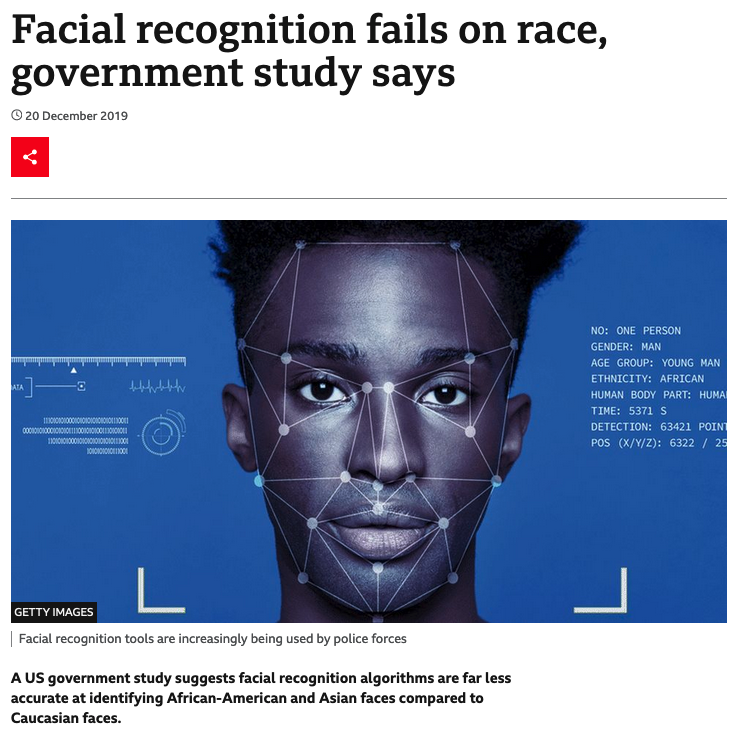
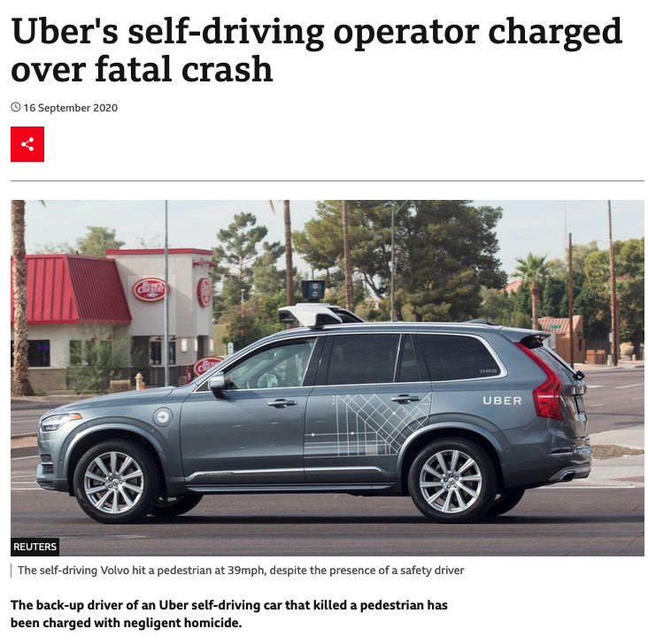

# Codes of Conduct {#ethics-conduct}

::: {.rmdnote} 
Effective Data Science is still a work-in-progress. This chapter is largely complete and just needs final proof reading. 

If you would like to contribute to the development of EDS, you may do so at <https://github.com/zakvarty/data_science_notes>.
:::

## Data Science: Miracle Cure and Sexiest Job

It has been more than 10 years since it was proclaimed that data science was the sexiest job of the century. Current turbulence in the technology sector may have you questioning the veracity of that claim, but it still rings true if we take a less myopic view of where data science is used.

::: medium_left

:::

Data science and machine learning are being used more extensively than ever across fields including medicine, healthcare and sociology. Data science is also applied to understand our environment, study ecological systems and inform our strategies for their preservation. In addition to this, data science is used widely across the private sector, where it informs business strategies and financial services, alongside the public sector where it influences governance and policy development.

## What could go wrong?

While data science methods can be wonderful, they are not infallible. As the number of use cases increases, we should also expect that the number of misuses or high-profile failures to increase too.

These two news articles highlight just how badly this can all go.

::: medium_right

:::

The first article shows how a combination of non-representative training data and lack of consideration on the part of developers led to a facial recognition system that was much less accurate for people with darker skin. This is absolutely unacceptable, particularly given the widespread use of similar systems in important security applications such as biometric ID for online banking or automatic passport gates.

A second example shows the risk of catastrophic failures in self-driving cars. We know that misclassification and missed edge cases are inevitable and that in the case of self-driving cars these errors can cause serious and even fatal accidents. We might then ask ourselves if these errors are acceptable if they lead to fewer accidents or fatalities than would be caused by human drivers.

::: medium_right

:::

Another important point to establish is where liability falls in such cases: should it be with the operator of the self-driving vehicle, the vendor who solid it or the data scientist who wrote the script controlling the car's actions? If this behaviour was determined by training data for test-drives, should that driver share in the liability.

These are all important questions that we haven't necessarily thought to ask before deploying data science solutions into the world.

## That's not *my* type of data science ...

You might be thinking at this doesn't effect you because you don't work in image analysis or on self-driving cars, but related issues come up in more standard applications of data science.

Consider a retailer implementing targeted promotions. They might combine previous shopping habits and recent product searches to target their offers.

::: medium_right
\begin{figure}

{\centering \includegraphics[width=0.9\linewidth]{images/503-ethics-conduct/pregnancy-prediction} 

}

\caption{Predicting pregnancy from search and purchase history.}(\#fig:unnamed-chunk-2)
\end{figure}
:::

Around 7 months ago, one customer stopped regularly buying contraceptives and alcohol and started buying supplements for vitamin D and folic acid. Based on similar behaviour by lots of other customers, a recommender model might now expect a good way to increase sales would be to send that customer offers for nappies, baby food and talcum powder.

This could be seriously upsetting if that customer also happened to be experiencing fertility issues or had been pregnant but had an abortion or miscarriage. It is important that human-overrides are included in such systems like this so that the customer could contact the retailer and prevent this sort of advertising from continuing to happen for months or years to come.

## Technological Adoption Relies on Public Trust {.smaller}

::: medium_left
\begin{figure}

{\centering \includegraphics[width=1\linewidth]{images/503-ethics-conduct/collapsed-bridge} 

}

\caption{Thirteen people were killed and 145 injured during the Interstate 35W bridge collapse in 2007.}(\#fig:unnamed-chunk-3)
\end{figure}
:::

Data science is a new discipline, which means that some of the issues we have mentioned are new and happening for the first time. However, many of these issues are not unique to data science and that means we can learn from other disciplines that have already invested a lot of time and energy into those problems.

Across many other professions it's standard to follow a professional code of practice or to have a code of ethics that applies to everyone working in that space. Usually, the professions that have this in place are also those who are legally liable in some way for the outcomes and consequences of their work.

The most obvious example of this might be doctors and other medical professionals, but this holds equally true in many jobs from law to engineering, where practitioner's work can impact the freedom or safety of other people. When thinking critically about the practical and ethical implications of our work as data scientists, we shouldn't start from scratch but should learn as much as possible from these other fields.

One profession in particular that we can learn from is medicine. Around the world, doctors agree to uphold the privacy of their patients by maintaining medical confidentiality. The also agree to only act in what they believe to be the best interests of the patient and to do them no harm. These are both admirable principles that can be tracked directly onto our work in data science.

Google's original internal code encapsulated a more extreme version of this non-maleficence principle, starting with the phrase 'Don't be evil' (thought this was later rephrased to 'You can make money without being evil').

## A Hippocratic Oath for Data Scientists

\begin{figure}

{\centering \includegraphics[width=0.9\linewidth]{images/503-ethics-conduct/wired-hippocratic} 

}

\caption{In Weapons of Math Destruction (2016), Cathy O’Neil was among the first authors to make a call for a Hippocratic oath for data scientists}(\#fig:unnamed-chunk-4)
\end{figure}

We've seen examples of both the broad and the acute harms that can befall individuals because of data science. With these in mind, it seems reasonable to expect that data scientists should have to be aware of the negative impacts of their work and be required to mitigate these wherever possible.

This is the argument made by Cathy O'Neil in her book Weapons of Math Destruction: data scientists, and those working with mathematical models more generally, need an equivalent of the Hippocratic oath that's used in medicine. To understand why this is necessary, we have to understand why it is *not* the case already.

Doing the right thing, in data science as in life,is neither obvious nor easy.

In the most naive sense, negative consequences can come about as a result of a lack of understanding or because of unanticipated consequences. This lack of understanding might relate to the model itself (which might not be explainable) or about the setting in which the model is being applied (which might require domain specific expertise that the data scientist lacks).

Alternatively, this ignorance can be about the groups of people who are most at risk of harm from data science models. Data science methods tend to model expected behaviour and echo biases from within the training data. This means that minority groups or groups that have been historically disadvantaged are most at risk of further harm. This same minority status or historical disadvantage means that these same groups have low representation within data science teams. This increases the chance that data science teams are ignorant of or ignore the breadth and depth of the damage they might be causing.

A second way that data science can lead to harm is when incentives are not properly aligned. As an example we consider a credit scoring application where a data scientist is trying to include fairness measures in addition to optimising predictive accuracy for loan repayments. If business incentives are purely based around immediate increases in profit, then this will likely be very difficult to get put into production. There is a misalignment between the priorities of the business and the ethics of the data scientist.

As we have seen,some errors are inevitable and sometimes the best we can do is to balance an inherent trade-off between conflicting priorities or different sources of harm. In these cases it is vitally important that we highlight this trade-off explicitly and offer decision makers a range of solutions that they may choose according to their own priorities.

Doing the right thing is neither obvious or easy:

- Lack of understanding,

- Unanticipated consequences

- Incentive structures,

- Inherent trade-offs.

## Codes of Conduct 

Membership of a professional body can offer some of the ethical benefits of a Hippocratic oath, because these memberships often require agreement to abide by a code of conduct.

This provides individual data scientists with accountability for their actions in a broader sense than through their direct accountability to their employer. This can be helpful as a motivator to at a high quality and in line with ethical guidelines.

It can also be useful as a form of external support, to convince organisations who employ data scientists that ethical considerations are an important aspect of our work. There is also the opportunity for peer-to-peer support, so that best practices can be established and improved in a unified way across industries, rather than in isolation within individual organisations. This might be through informal networking and knowledge sharing or through formal training organised by that professional body.

Data science is still a developing field and there currently is no professional body specifically dedicated to data science. Instead, data scientists might join one or more related professional bodies, such as the [Royal Statistical Society](https://rss.org.uk/), the [Operational Research Society](https://www.theorsociety.com/),) or the [Society for Industrial and Applied Mathematics](https://www.siam.org/).

## Wrapping Up 

Data Science is still maturing, both as a field of study and as a career path. In combination with the widespread adoption of data science in recent years, this means that as a discipline we're now navigating many new modes of failure and ethical issues. However, not all of these issues are entirely novel. There is an awful lot that we can learn, borrow or adapt from more established fields such as medicine, engineering or physics.

It is important that we remain alert to the dangers of our work: both the liability it opens us up to and the harm we might be causing to others, potentially without being aware of either of these things. By joining professional bodies and upholding their codes of conduct we can push back against bad practices and reward good ones.
